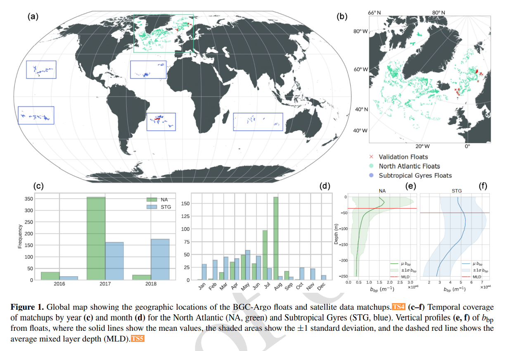

# Combining BGC-Argo floats and satellite observations for water column estimations of the particulate backscattering coefficient

The study examines how satellite-derived bio-optical properties of the ocean surface , when combined with BGC-Argo profiles, can be used to reconstruct the vertical structure of the particulate backscattering coefficient (bbp) throughout the upper 250 meters of the water column. It builds on the SOCA2016 method developed by Sauzède et al. (2016).

Sauzède et al., 2016 — https://doi.org/10.1002/2015JC011408

## Related Publication

Full description, methodology and results in:

> **Combining BGC-Argo floats and satellite observations for water column estimations of the particulate backscattering coefficient**  
> Jorge García-Jiménez, Ana B. Ruescas, Julia Amorós-López, Raphaëlle Sauzède  
> *EGUsphere (2025)*  
> [🔗 Read the article](https://os.copernicus.org/articles/21/1677/2025/)

## Regions of Interest

- North Atlantic
- Subtropical Gyres

<div align="center">
  
</div>

## Modeling Approach

- **Model type**: Multi-output Random Forest Regressor
- **Input features**:
  - Sentinel-3 OLCI: reflectances at 12 wavelengths, C2RCC IOPs (*apig, adet, agelb, bpart, bwit, atot, btot*)
  - GlobColour: reflectances at 5 wavelengths
  - GlobalOcean: Sea Level Anomaly (SLA)
  - BGC-Argo Float profiles: temperature, salinity, density, spiciness (via PCA)
  - Mixed Layer Depth (MLD)
  - Spatial-temporal: latitude, longitude, day of year
- **Target**: Particulate Backscattering Coefficient (Bbp):
  - 26 depths for the 0–50 m model  
  - 126 depths for the 0–250 m model
  
## Model Performance – Deep Profiles (0–250 m)

<div align="center">
  
</div>

## Notebooks Overview
| Notebook                             | Purpose                                                                |
| ------------------------------------ | ---------------------------------------------------------------------  |
| `0_data_analysis.ipynb`              | Quick exploration of datasets (Argo profiles, temporal distribution...)|
| `1_run_single_experiment.ipynb`      | Run and validate a model for one region–depth–experiment               |
| `2_experiments_analysis_plots.ipynb` | Load and compare performance metrics across multiple experiments       |

### How to use

1. Install the environment with Pixi (see below)
2. Launch Jupyter

```bash
pixi run jupyter lab
```

## How to Cite

### APA

> García-Jiménez, J., Ruescas, A. B., Amorós-López, J., & Sauzède, R. (2025). *Combining BGC-Argo floats and satellite observations for water column estimations of the particulate backscattering coefficient*. EGUsphere. https://doi.org/10.5194/egusphere-2024-3942

### BibTeX

```bibtex
@article{garcia-jimenez2025bbp,
  author    = {García-Jiménez, Jorge and Ruescas, Ana B. and Amorós-López, Julia and Sauzède, Raphaëlle},
  title     = {Combining BGC-Argo floats and satellite observations for water column estimations of the particulate backscattering coefficient},
  journal   = {EGUsphere},
  year      = {2025},
  doi       = {10.5194/egusphere-2024-3942}
}
```

## Project structure
<pre>
SatArgoBbp/
├── src/
│   ├── data_loader.py          # Load and preprocess dataset
│   ├── feature_selector.py     # Feature selection by experiment type
│   ├── model/
│   │   ├── train.py            # Training pipeline
│   │   └── model_metrics.py    # Evaluation metrics (R², MAE, Bias, etc.)
│   ├── plotting/
│   │   └── plot_utils.py       # Plotting functions for model performance and comparisons
│   ├── evaluation/
│   │   └── metrics_loader.py   # Load and aggregate metric CSVs
│   └── utils.py                # Experiment setup, config classes, I/O helpers
│
├── notebooks/                  # Jupyter notebooks for running and analyzing experiments
│   ├── 0_data_analysis.ypnb
│   ├── 1_run_single_experiment.ipynb
│   └── 2_experiments_analysis_plots.ipynb
│
├── datasets/                   # Processed input datasets (excluded from Git — contact us if interested)
├── results/                    # Saved metrics, plots, models and model outputs
│
├── scripts/ (to do)            
│   └── run_all_experiments.py  # Script to batch-run all experiments
│
├── docs/
│   └── img/                    # Figures for README and manuscript
│
├── .gitignore
├── README.md
├── pixie.toml                 # Project environment and dependencies (managed with Pixi)
└── pixi.lock                  # Pixi lockfile
</pre>
### How to clone the repository

This project uses [Pixi](https://prefix.dev) for fully reproducible environment management.

### Step 1 — Install Pixi (if not already installed)

```bash
curl -sSf https://pixi.sh/install.sh | bash
```
After installation, restart your terminal or reload your shell:

```bash
exec $SHELL
```

### Step 2 — Clone the Repository

```bash
git clone git@github.com:IPL-UV/SatArgoBbp.git
cd SatArgoBbp
```
### Step 3 — Set Up the Environment

```bash
pixi install
```
This command reads `pixi.toml` and creates the environment with all dependencies.

---

### Step 4 — Activate the Environment

```bash
pixi shell
```

### Step 5 — Run Notebooks or Scripts

To launch the Jupyter interface:

```bash
pixi run jupyter lab
```


