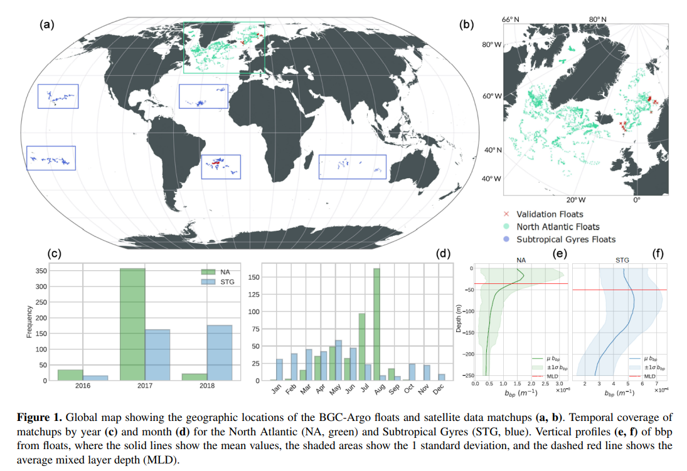

# Ocean Modeling with Random Forest

This project applies Random Forest regression to oceanographic data (GlobColor, Sentinel-3 OLCI, IOPs) for predicting variables at different depths and regions.

## Structure

- `src/`: Modeling and utility functions
- `data/`: Processed input datasets
- `notebooks/`: Experimentation and validation
- `results/`: Outputs like plots, metrics, and figures

## Example Plot

